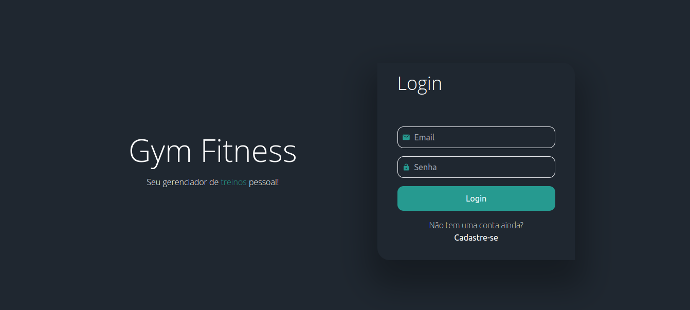
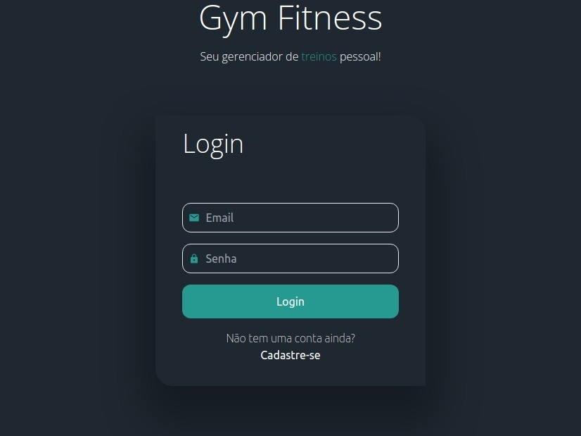
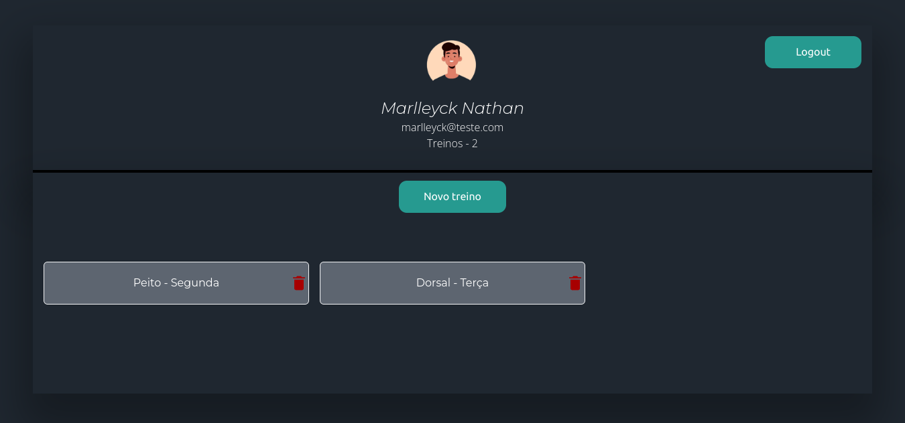
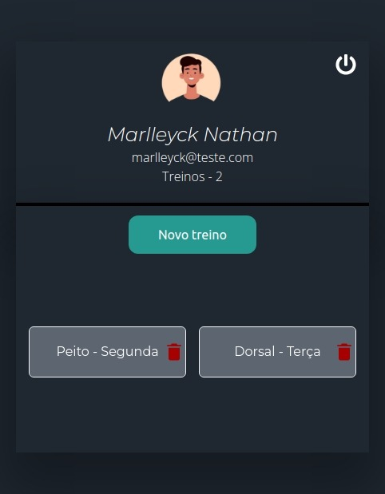
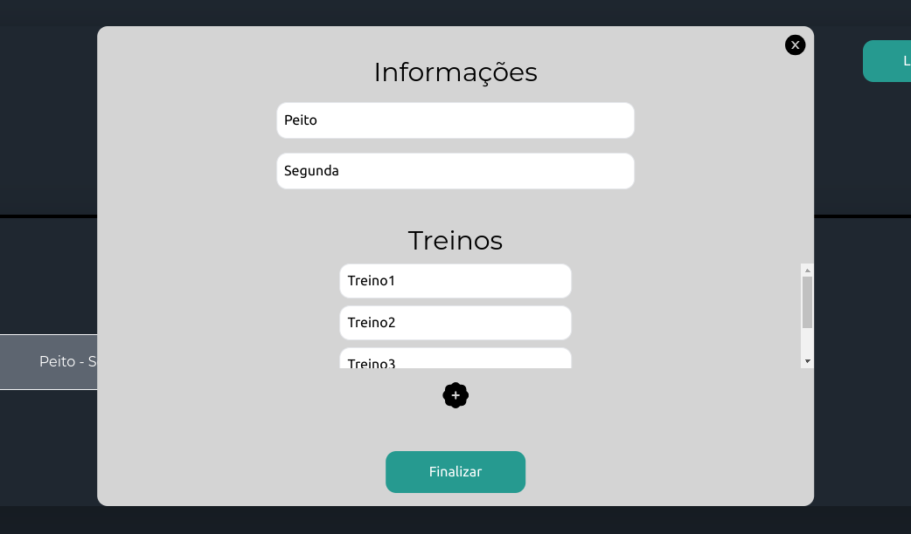
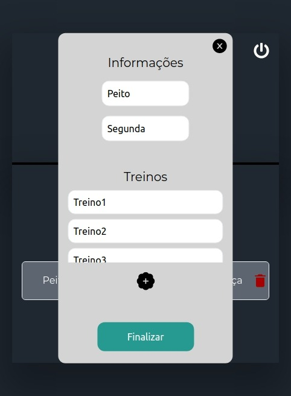

<h1 align="center">Fitness Project</h1>

  

    
  

  

   
  
  

    
  

  

   
  
  

    
  

  

   
  
  

    
  

  

   
  
  

    
  

  

   
  
  

    
  

  

   

<h1 align="center">:sparkles: Tecnologias</h1>

Esse projeto foi desenvolvido com</h1>
 

<a href="https://pt-br.reactjs.org/">ReactJs</a>

<a href="https://tailwindcss.com/">Tailwindcss</a>

<a href="https://nodejs.org/en/">NodeJs</a>

<a href="https://www.mysql.com/">MySql</a>

<a href="https://expressjs.com/pt-br/">Express</a>

<a href="https://sequelize.org/">Sequelize</a>

<a href="https://jwt.io/">JWT</a>

 

<h1 align="center">:computer: Sobre o Projeto</h1>

Aplicação feita com ReactJs (frontend) e NodeJs (backend), em que consiste um gerenciador de treinos de academia, onde o usuário pode se cadastrar utilizando seus dados, e esses dados serão cadastrados em um banco SQL (MySql com Sequelize), após isso, é possível fazer o login na aplicação.
Nesse sistema o fluxo de login é utilizado JsonWebToken para persistência e autorização do usuário e usado o Bcrypt para criptografar a senha. Já no Front, as rotas são protegidas com autenticação e validação de token, para evitar burla de segurança.   O usuário, autenticado, pode ter acesso a uma página onde tem as informações da sua conta e lá pode adicionar ou remover seus treinos como melhor desejar.

 

<h1 align="center">:rocket: Executando o Projeto</h1>

Comece clonando o repositório para sua máquina, usando

<pre><strong>$ git clone https://github.com/marlleyck/fitness-project</strong></pre>

Após isso, vá até a pasta do projeto

<pre><strong>$ cd fitness-project</strong></pre>

Instale todas as dependências, em cada pasta, usando o seu gerenciador de pacotes preferido

<pre><strong>$ cd frontend && npm install</strong></pre>
<pre><strong>$ cd backend && npm install</strong></pre>

ou

<pre><strong>$ cd frontend && yarn</strong></pre>
<pre><strong>$ cd backend && yarn</strong></pre>

Crie um arquivo ".env" na raíz da pasta "backend/" e coloque as informações do seu banco de dados seguindo o nome das variáveis que estão em "backend/src/database/index.js"

<pre><strong>$ mkdir .env</strong></pre>

 

Por fim, basta iniciar os servidores, usando

<pre><strong>$ cd frontend && npm run dev</strong></pre>
<pre><strong>$ cd backend && npm run dev</strong></pre>

ou

<pre><strong>$ cd frontend && yarn dev</strong></pre>
<pre><strong>$ cd backend && yarn dev</strong></pre>

Feito! O projeto está pronto para ser utilizado!

